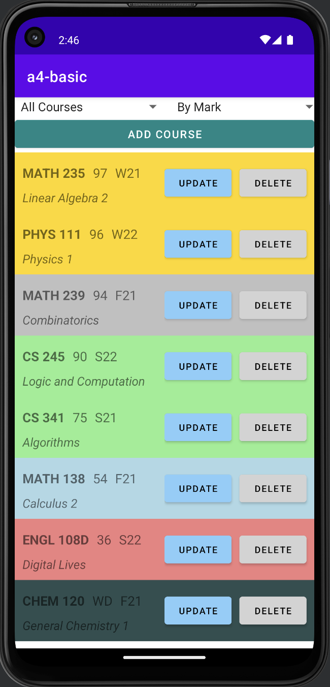
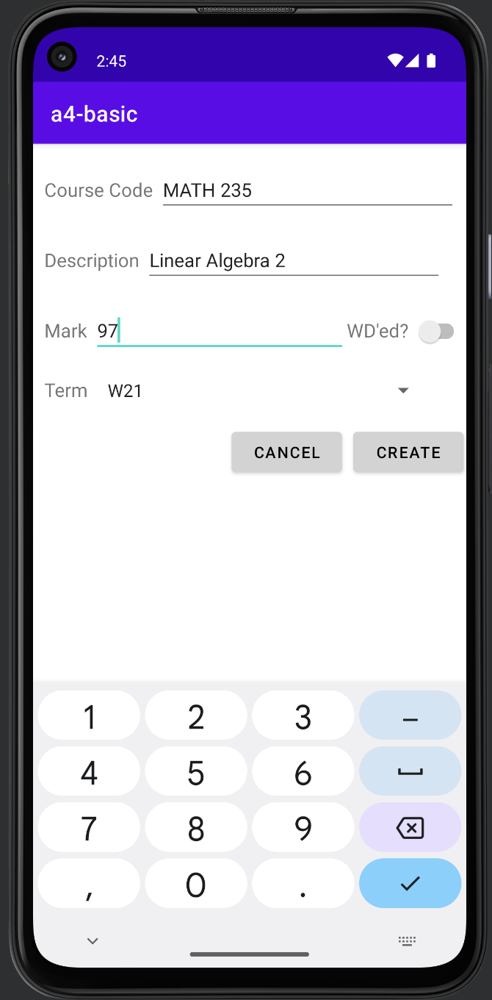
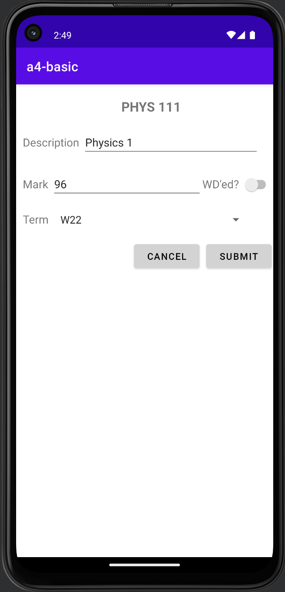
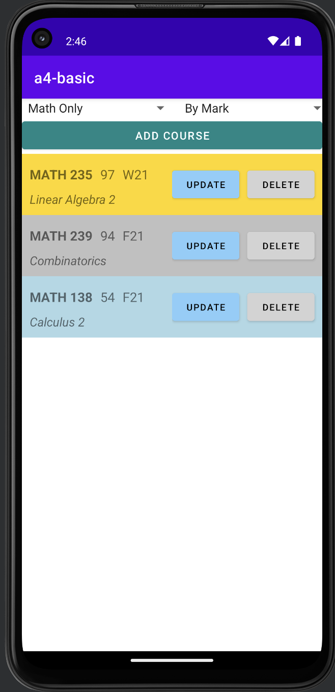

# Mobile Mark Management
Welcome to the Mark Management Andriod Application!          

## Introduction
This application is designed to help you keep track of the courses you have taken during your academic journey at UW (University of Waterloo). With this application, you can easily manage your course information, perform various operations like adding, modifying, and removing course details, and gain valuable insights into your grades through visualizations, filtering, and sorting options.

## Features
**Course Management:** The application provides a user-friendly interface to add new courses, update existing course information, and remove courses from your record. You can easily input essential details such as course code, title, credit hours, and the corresponding grade for each course.

**Filtering and Sorting:** Quickly find and organize your course records using filtering and sorting options. You can filter courses based on course code. Additionally, you can sort your courses in ascending or descending order based on various attributes like course code, term, or grade.

## Setup
Ensure that your system is running macOS 12.6 or a compatible operating system.

Install IntelliJ IDEA 2022.3.1 (Ultimate Edition) as your preferred IDE.  You can download IntelliJ IDEA from the JetBrains website and follow the installation instructions specific to your operating system.

Install the Android SDK and set up the required Android API level.  Since the Mark Management Application utilizes Android features, you need to install the appropriate Android SDK version.  In this case, the application targets Android API 33.

To run and test the Mark Management Application, you need an Android device emulator or a physical device.  For example, you can use the Pixel 4a device for testing.  Set up the device emulator using the Android Virtual Device (AVD) Manager in IntelliJ IDEA or connect your physical device via USB debugging.
